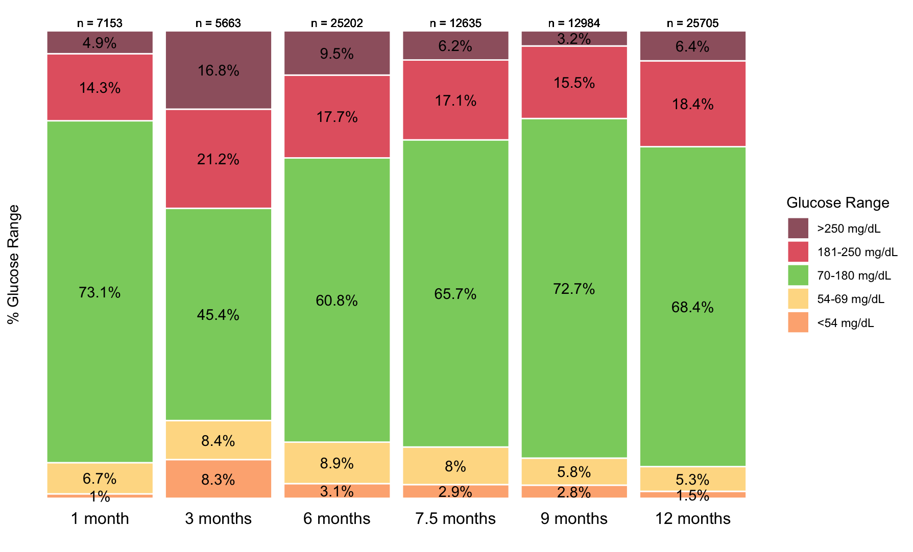

```{r, include = FALSE}
knitr::opts_chunk$set(
  collapse = TRUE,
  comment = "#>"
)
```

```{r setup}
library(fourT)
```

```{r, include = F}
library(magrittr)
library(dplyr)
library(utils)
library(knitr)
```
## Introduction

The 4T study is a team-based, technology drive type 1 diabetes management program at Stanford. The 4T study consists of multiple states. The 4T study began with Pilot 4T (2018-2020). Associated with this is 4T Pilot and Pre-Pilot Study Database. 4T Study 1 followed (May 2021 - present) and then 4T Study 2 (March 2022 - ). The 4T Study 1 "assessed the impact of a systematic and equitable digital-health-team-based care program implementing tighter glucose targets (HbA1c < 7%), early technology use (continuous glucose monitoring starts <1 month after diagnosis) and remote patient monitoring on glycemia in young people with newly diagnosed T1D enrolled in the Teamwork, Targets, Technology, and Tight Control"^[Prahalad, P., Scheinker, D., Desai, M. et al. Equitable implementation of a precision digital health program for glucose management in individuals with newly diagnosed type 1 diabetes. Nat Med 30, 2067–2075 (2024). https://doi.org/10.1038/s41591-024-02975-y]. The primary outcome for 4T Study 1 was change in HbA1c from 4 to 12 months after diagnosis. The secondary outcome was achieving HbA1c targets. There are some common metrics and visuals computed with continuous glucose monitoring (CGM data):

 * ambulatory glucose profile (AGP) thermometers (time in range (TIR), time in tight range (TITR), time below range (TBR), time below range 2 (TBR2), time above range (TAR), time above range 2(TABR2))
 * glucose management indicator (GMI)
 * CGM wear time (proportion of eligible hours worn)
 * AGP stacked bar plot

## fourT Package Aim and Overview

There are many, many people involved in 4T. Many of these people use different code to compute the various metrics associated with the 4T study. The fourT package aims to homogenize computation and visualization methods, enable quicker workflow and enable easier collaboration with other institutions. 

There are three groups of functions in the fourT package, computation functions, visualization functions and helper functions. All functions in the fourT package operate on two types of objects, individual patients and cohorts. An individual patient is a single patient's dexcom data (.csv) file. A cohort is a collection of individual patients stored in a single folder.

## Example Workflow

To use the fourT package the user must first read the patient file using the 'read_dexcom' function.

```{r ,include = F}
  oldw <- getOption("warn")
  options(warn = -1)
```

```{r ,message=FALSE}
  df_dex1 <- read_dexcom("~/Desktop/R Workspace/4T/external files/4T.999_Clarity_Export_00999_Doe_John_2024-07-05_091012.csv")
```

This cleans entries which may have the date-time incorrectly inputted (i.e. NA values) and reformats the data. The 'read_dexcom' function can also optionally remove PHI and randomize the year to deidentify the data; this is controlled by the 'deid' parameter.

```{r, include = F}
  df_dex1_truncated <- head(df_dex1, 10)
```


```{r, echo=FALSE}
  # I want to only show the ouput here, not the code
    knitr::kable(df_dex1_truncated)
```

The default setting of 'read_dexcom' is with 'deid = FALSE', i.e. without deidentification. This reflects usage inside of the QSU where deidenitfying the data may not be an issue. When working with outside collaborators the deidentification can be switched on by setting the 'deid' parameter to TRUE.

```{r, return = "hide"}
  df_dex2 <- read_dexcom("~/Desktop/R Workspace/4T/external files/4T.999_Clarity_Export_00999_Doe_John_2024-07-05_091012.csv", deid = T)
```

```{r, include = F}
  df_dex2_truncated <- head(df_dex2, 10)
```

```{r, echo=FALSE}
  # I want to only show the ouput here, not the code
    knitr::kable(df_dex2_truncated)
```

```{r ,include = F}
  
  options(warn = oldw)
```

After reading the patient file, any of the computation or visualization functions can be applied independently. For example, the user could compute wear time, AGP thermoemters and GMI every 14 days, with a 90 day lookback window. 

```{r}
  compute_agp(df_dex1, freq = 14)
  compute_gmi(df_dex1, freq = 14)
  compute_wear_time(df_dex1)
```

There are multiple different options for breaking up the time window for each function.

```{r}
  compute_agp(df_dex1, freq = 14)
  compute_gmi(df_dex1, breaks = c(0, 1, 3, 6, 7.5, 9, 12))
  compute_wear_time(df_dex1, start = , end = )
```

If one would like to instead compute all of these metrics at the same time, with the same time window partition they can simply call the wrapping function 'cgm_summaries()'.

```{r}
  cgm_summaries(df_dex1, breaks = c(0, 1, 3, 6, 7.5, 9, 12))
```

This function can also be used to simultaneously create the AGP thermometer stacked bar plot, by setting 'plot = T' (the above tabular output is hidden when cgm_summaries() is called below).

```{r, eval = FALSE}
  cgm_summaries(df_dex1, breaks = c(0, 1, 3, 6, 7.5, 9, 12), plot = T)
```

<center>

```{r, echo = F, out.width = "600px"}

```

<center>

This same workflow works at the cohort level.

## Documentation

```{r}
?compute_gmi
```


## Package Structure

<center>

```{r, echo = F, out.width = "1000px"}
library(DiagrammeR)

grViz("
digraph function_web {

  # Define the nodes
  node [shape = box, style = filled, color = lightblue]
  compute_avg_glucose -> {compute_agp compute_agp_for_plot compute_gmi convert_bv}
  compute_agp -> {compute_agp_for_plot make_plot}
  compute_gmi -> make_plot
  compute_agp_for_plot -> plot_agp
  plot_agp -> make_plot
  make_plot -> plot

  # Define the nodes for external functions
  compute_wear_time -> filter
  check_lookback -> {compute_agp change_window}
  change_window -> truncate_window
  truncate_window -> {filter find_end_date find_start_date}
  set_inter -> filter
  cgm_summaries -> {compute_avg_glucose compute_gmi plot_agp}
  check_days_minimum -> cgm_summaries
  read_dexcom -> cgm_summaries
  convert_bv -> compute_avg_glucose

  # Define subgraphs for categorization
  subgraph cluster_plotting {
    label = 'Plotting Functions'
    color = lightgrey
    plot_agp -> make_plot
    make_plot -> plot
  }

  subgraph cluster_computations {
    label = 'Computational Functions'
    color = lightgreen
    compute_avg_glucose -> {compute_agp compute_agp_for_plot compute_gmi}
    compute_agp -> compute_agp_for_plot
    compute_gmi -> make_plot
    compute_wear_time -> filter
    check_lookback -> {compute_agp change_window}
    change_window -> truncate_window
    truncate_window -> {filter find_end_date find_start_date}
    set_inter -> filter
    cgm_summaries -> {compute_avg_glucose compute_gmi plot_agp}
    check_days_minimum -> cgm_summaries
    read_dexcom -> cgm_summaries
    convert_bv -> compute_avg_glucose
  }

  # Main function call
  compute_avg_glucose -> compute_agp_for_plot

  # Optional: Customize the graph's appearance
  graph [rankdir = TB] # Layout the graph from top to bottom
}
")

```

<center>


## Computation Functions

There are four computation functions: 'compute_gmi', 'compute_agp', 'compute_wear_time', and 'compute_avg_glucose'. Each computation function operates without reference to another, except for 'compute_gmi', which calls 'compute_avg_glucose'; the 'compute_avg_glucose' function can also be called independently by the user. 

Time control parameters: There are three primary ways in which to time window for computation can be modified:

1. 'start' and 'end' parameters
2. 'inter' parameter
3. 'breaks' parameter

The 'start' and 'end' parameters are straightforward, the user can manually enter start and end dates for the individual patient. If no start and end dates are inputted, the default values are ... something ... .

The 'inter' parameter allows for the specification of regular interval windows in which the metric should be computed. When using the 'inter' parameter, the user should be intentional with their choice of 'cut_reference' value. The intervals are computed based on the start date or end date depending on the choice of 'cut_reference' value.

Example 1: start = "default", end = "default", inter = 14, breaks = NULL, cut_reference = "end"

<center>

</center>

The 'breaks' parameter allows metrics to be computed at different time points, e.g. 1 month, 2 months, 6 months, 12 months.

Example 2: start = "default", end = "default", breaks = c(0, 1, 3, 6, 12)

<center>

</center>

Example 3:
```{r, error = T}
  df_dex <- read_dexcom("~/Desktop/R Workspace/4T/external files/4T.399_Clarity_Export_00123_Doe_John_2024-05-01_162849.csv")
  fourT::compute_gmi(df_dex = df_dex, start = "default", end = "default", inter = 14, breaks = c(0, 1, 3, 6, 12))
```

Both 'inter' and 'breaks' are specified, which is not allowed.

## Visualization functions


## Helper functions

The only helper function currently in the package is the 'read_dexcom' function. This reads a patient .csv file, removes sensitive patient health information and converts the file into the correct format to apply computation and visualization functions.

## Development

<center>


<center>

## Next Steps for fourT Package


What does this package do
What are the various workflows (or just idela workflow)
What is the documentation supported in package
What is the structure of the package
 - dependencies
 - how cohort functions generalize individual patient functions
How did I develop this package
 - doing version control in github
    -- show a bit of my github + r workflow
    -- how can this be more helpful when it's not just one person using it
    
Full walkthrough on package use


  

```{r, include = FALSE}
#x_0 <- read_dexcom("~/Desktop/R #Workspace/4T/fourT/vignettes/4T.399_Clarity_Export_00123_Doe_John_2024-05-01_162849.csv", F)
#x_1 <- compute_wear_time(x_0)
#x_2 <- compute_agp(x_0, 1)
#x_3 <- compute_gmi(x_0, 1)
#x_4 <- compute_avg_glucose(x_0, 1)
```

One can read a patient file as follows ...
```{r, message = FALSE}
#read_dexcom(filepath, F)
#View(read_dexcom(filepath, F))
```


